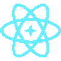

<p align='center'>
  <a href='https://github.com/codingcodax/slug'>
    
  </a>

  <h3 align='center'>new-comp</h3>

  <p align='center'>
    <samp>An awesome CLI utility for quickly create new React components.</samp>
    <br />
    <a href='https://www.npmjs.com/package/n-comp' rel='noopener noreferrer' target='_blank'><strong>NMP Package</strong></a>
    <br />
    <br />
    <a href='https://github.com/codingcodax/new-comp/issues/'>Feature Request</a>
    ·
    <a href='https://github.com/codingcodax/new-comp/issues/'>Bug Report</a>
  </p>
</p>

## Features

- Create React components.
- Choose between TypeScript and JavaScript.
- Components can be function, arrow or class.
- Even you can use your favorite ui library (personal whim).

## Quickstart

From your terminal run:

```bash
# install the package with NPM
$ npx n-comp

# or install it with YARN
$ yarn n-comp
```

`cd` into your project's directory, and try creating a new component:]

```bash
$ new-component MyNewComponent
```

Your project will now have a new directory at `src/components/MyNewComponent`. This directory has two files:

```javascript
// `MyNewComponent/index.js`
export { default } from './MyNewComponent';
```

```javascript
// `MyNewComponent/MyNewComponent.js`
function MyNewComponent() {
  return (
    <div>
      <p>MyNewComponent</p>
    </div>
  );
}

export default MyNewComponent;
```

These files will be formatted according to your Prettier configuration.

## Configuration

Configuration can be done through 3 different ways:

- Creating a global `.nc.config.json` in your home directory (`~/.nc.config.json`).
- Creating a local `.nc.config.json` in your project's root directory.
- Command-line arguments.

The resulting values are merged, with command-line values overwriting local values, and local values overwriting global ones.

## API Reference

### Language

Controls which language, JavaScript or TypeScript, should be used.

- `ts` — creates a `.tsx` file (default).
- `js` — creates a `.js` file.

**Usage:**
Command line: `--lang <value>` or `-l <value>`

JSON config: `{ "lang": <value> }`

### Type

Controls which type of component, function, arrow or class should be used.

- Function — use `function MyNewComponent() {}`
- Arrow — use `const MyNewComponent = () => {}`
- Class — use `class MyNewComponent extends React.Component {}`

**Usage:**
Command line: `--type <value>` or `-t <value>`

JSON config: `{ "type": <value> }`

### UI Library

Controls which ui library, vanilla, Chakra UI or MUI should be used.

- Vanilla — use `<div>` and `<p>` tags.
- Chakra UI — use `<Box>` and `<Text>` components.
- Material UI — use `<Box>` and `<Typography>` components.

**Usage:**
Command line: `--ui <value>`

JSON config: `{ "ui": <value> }`

### Directory

Controls the desired directory for the created component. Defaults to `src/components`

**Usage:**
Command line: `--dir <value>` or `-d <value>`

JSON config: `{ "dir": <value> }`

## License

Licensed under the [MIT license](./LICENSE.md)
